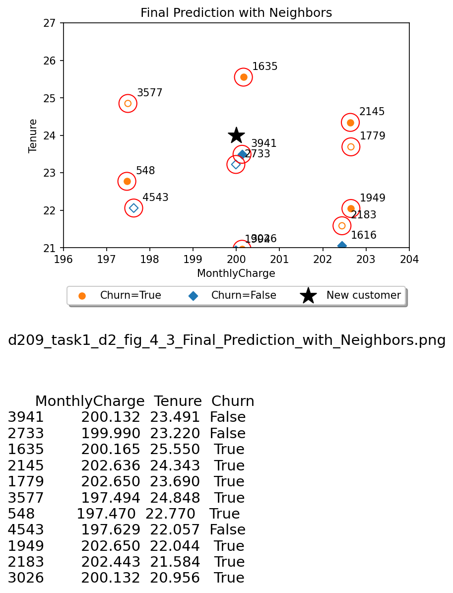

# Data_Mining_I_D209
Data Mining I expands predictive modeling into nonlinear dimensions, enhancing the capabilities and effectiveness of the data analytics lifecycle. In this course, learners implement supervised models—specifically classification and prediction data mining models—to unearth relationships among variables that are not apparent with more surface-level techniques. The course provides frameworks for assessing models’ sensitivity and specificity. D208 Predictive Modeling is a prerequisite to this course.

